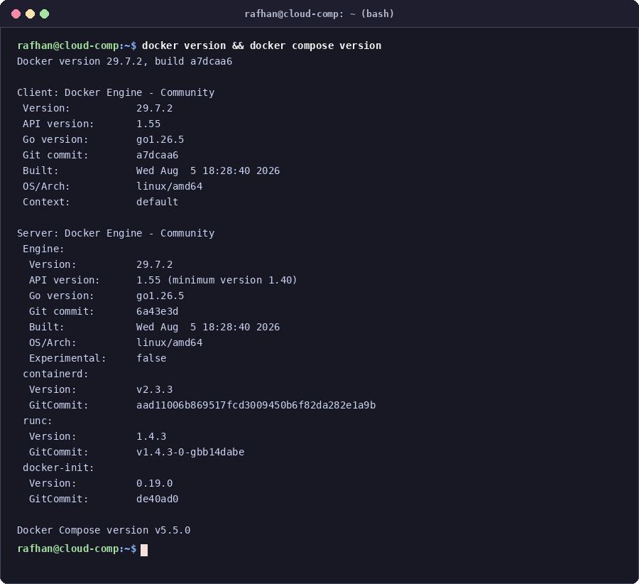
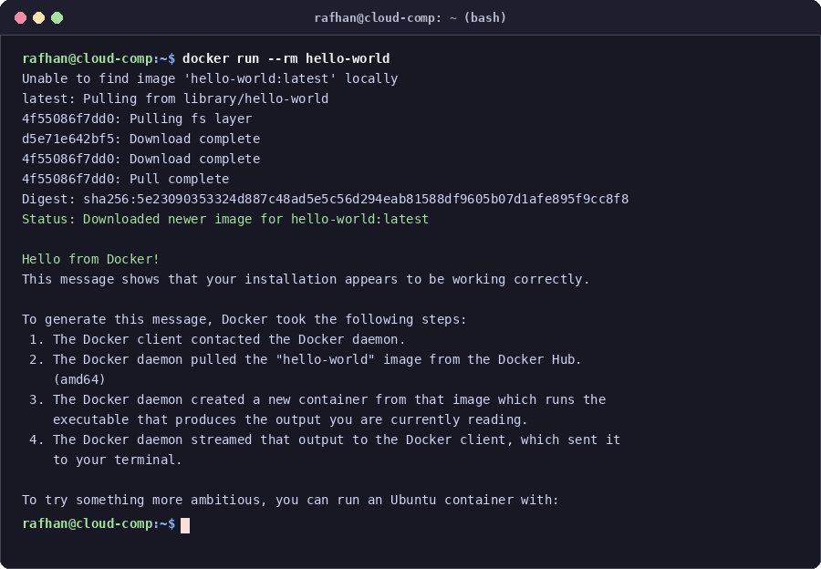
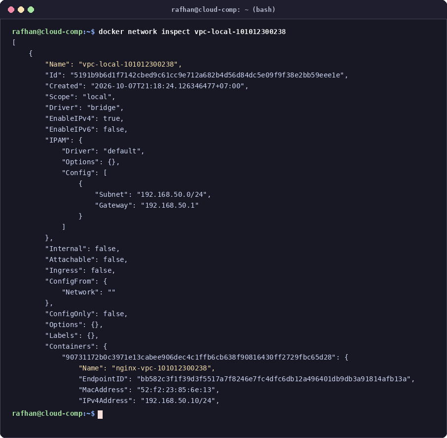

# Repositori Tugas Praktikum Cloud Computing — Docker
**Program Studi S1 Teknik Telekomunikasi / Cloud Computing (BS1TT-47-REG-GAB01)**

---

## 👨‍🎓 Identitas Mahasiswa
- **Nama Lengkap**   : Rafhan Mazaya Fathurrahman
- **NIM**            : 101012300238
- **Kelas**          : BS1TT-47-REG-GAB01
- **Mata Kuliah**    : Cloud Computing
- **Dosen Pengampu** : Cahyo Alhazim
- **Tautan Repositori**: [https://github.com/fhanyuh/cloud-computing-docker-101012300238](https://github.com/fhanyuh/cloud-computing-docker-101012300238)

---

## 📚 Ringkasan & Navigasi Tugas

Repositori ini mencakup penyelesaian lengkap untuk dua penugasan praktikum Docker:

### 1. [Tugas 1: Docker Engine Installation & Lab Simulasi VPC (IaaS)](./tugas1-docker-installation/)
- **Instruksi LMS**: *"upload link hasil install docker di local kalian masing2 ya"* (`id=827889`).
- **Materi Pendukung**: Materi Pertemuan 1 (*Slide 14–17* `cloud-1.pptx`).
- **Deliverables**:
  - 📄 **Laporan PDF**: [`tugas1-docker-installation/laporan-instalasi.pdf`](./tugas1-docker-installation/laporan-instalasi.pdf)
  - 📝 **Laporan Markdown**: [`tugas1-docker-installation/laporan-instalasi.md`](./tugas1-docker-installation/laporan-instalasi.md)
  - 📋 **Log Eksekusi Nyata**: [`tugas1-docker-installation/logs/`](./tugas1-docker-installation/logs/)
  - 🖼️ **Bukti Screenshot**:
    1. `01-docker-version.png`: Verifikasi Docker Engine 29.7.2 & Compose Plugin v5.5.0
    2. `02-docker-hello-world.png`: Verifikasi container hello-world
    3. `03-iaas-vpc-network.png`: Simulasi VPC bridge `192.168.50.0/24` + Nginx IP statis `192.168.50.10`

---

### 2. [Tugas 2: Docker Hands-on Lifecycle, Dockerfile, & Compose](./tugas-docker-101012300238/)
- **Instruksi LMS**: *"Homework Docker Handson"* (`id=827891`).
- **Bagian 1**: Siklus hidup container `ubuntu:22.04` (nama container `tes-ubuntu-101012300238`).
- **Bagian 2**: Aplikasi web Python (`app.py`) + custom `Dockerfile` (`ENV STUDENT_NIM=101012300238`).
- **Bagian 3**: Orkestrasi multi-service dengan Docker Compose (`web` & `cache`).
- **Deliverables**:
  - 📄 **Laporan PDF**: [`tugas-docker-101012300238/laporan-handson.pdf`](./tugas-docker-101012300238/laporan-handson.pdf)
  - 📝 **Laporan Markdown**: [`tugas-docker-101012300238/laporan-handson.md`](./tugas-docker-101012300238/laporan-handson.md)
  - 🐍 **Kode Sumber**: [`app.py`](./tugas-docker-101012300238/app.py), [`Dockerfile`](./tugas-docker-101012300238/Dockerfile), [`docker-compose.yml`](./tugas-docker-101012300238/docker-compose.yml)
  - 📋 **Log Eksekusi Nyata**: [`tugas-docker-101012300238/logs/`](./tugas-docker-101012300238/logs/)
  - 🖼️ **Screenshot Wajib LMS**:
    1. **Screenshot 1**: [`screenshot-1-compose-ps.png`](./tugas-docker-101012300238/screenshots/screenshot-1-compose-ps.png) (`docker compose ps` menampilkan service `web` & `cache` status **Up**)
    2. **Screenshot 2**: [`screenshot-2-curl.png`](./tugas-docker-101012300238/screenshots/screenshot-2-curl.png) (`curl http://localhost:8080` menampilkan respon HTML dengan NIM `101012300238`)

---

## 📁 Struktur Direktori Repositori

```text
.
├── README.md                                  # Dokumentasi utama repositori
├── .gitignore                                 # Mengabaikan file temporary, zip, pptx
├── tugas1-docker-installation/                # Direktori Tugas 1
│   ├── laporan-instalasi.md                   # Laporan teknis instalasi (Markdown)
│   ├── laporan-instalasi.pdf                   # Laporan teknis instalasi (PDF resmi)
│   ├── logs/                                  # Catatan log stdout/stderr perintah nyata
│   │   ├── 01-os.log
│   │   ├── 02-docker-version.log
│   │   ├── 03-compose-version.log
│   │   ├── 04-docker-info.log
│   │   ├── 05-systemctl-status.log
│   │   ├── 06-hello-world.log
│   │   ├── 07-user-groups.log
│   │   ├── 08-apt-policy.log
│   │   ├── 09-create-vpc.log
│   │   ├── 10-run-nginx-vpc.log
│   │   ├── 11-inspect-vpc.log
│   │   ├── 12-curl-vpc.log
│   │   └── 13-cleanup-vpc.log
│   └── screenshots/                           # Tangkapan layar terminal hasil eksekusi
│       ├── 01-docker-version.png
│       ├── 02-docker-hello-world.png
│       └── 03-iaas-vpc-network.png
└── tugas-docker-101012300238/                 # Direktori Tugas 2
    ├── app.py                                 # Kode aplikasi web Python HTTP server
    ├── Dockerfile                             # Dokumen instruksi perakitan image
    ├── docker-compose.yml                     # Orkestrasi multi-service (web & cache)
    ├── laporan-handson.md                     # Laporan praktikum hands-on (Markdown)
    ├── laporan-handson.pdf                    # Laporan praktikum hands-on (PDF resmi)
    ├── logs/                                  # Log stdout eksekusi perintah hands-on
    │   ├── b1-01-run-interactive.log
    │   ├── b1-02-ps-exited.log
    │   ├── b1-03-rm.log
    │   ├── b2-01-build.log
    │   ├── b2-02-compose-up.log
    │   ├── b2-03-compose-ps.log
    │   ├── b2-04-curl.log
    │   ├── b2-05-compose-logs.log
    │   └── b2-06-compose-down.log
    └── screenshots/                           # Tangkapan layar wajib LMS
        ├── screenshot-1-compose-ps.png        # WAJIB: status kedua service Up
        └── screenshot-2-curl.png              # WAJIB: curl respon ber-NIM
```

---

## 🚀 Panduan Reproduksi & Menjalankan Praktikum

Untuk mereproduksi atau menjalankan layanan web di komputer penguji/dosen:

### 1. Kloning Repositori
```bash
git clone https://github.com/fhanyuh/cloud-computing-docker-101012300238.git
cd cloud-computing-docker-101012300238/tugas-docker-101012300238
```

### 2. Jalankan Layanan via Docker Compose
```bash
docker compose up -d
```

### 3. Periksa Status Kontainer
```bash
docker compose ps
```
*Output yang diharapkan: `web-container-101012300238` dan `cache-container-101012300238` berstatus `Up`.*

### 4. Uji Akses Layanan Web
```bash
curl http://localhost:8080
```
*Akan menghasilkan dokumen HTML yang memuat teks: `Dikembangkan oleh NIM: 101012300238`.*

Bisa juga diakses langsung via web browser di: [http://localhost:8080](http://localhost:8080).

### 5. Menghentikan Layanan
```bash
docker compose down
```

---

## 📸 Lampiran Tangkapan Layar Utama

### Tangkapan Layar Tugas 2 (Wajib LMS)

#### 1. Verifikasi Status Layanan Up (`docker compose ps`)


#### 2. Verifikasi Respon Web Berisi NIM (`curl http://localhost:8080`)


---

### Tangkapan Layar Tugas 1 (Instalasi & Lab VPC)

#### 1. Versi Docker & Compose


#### 2. Hello World Container


#### 3. Simulasi IaaS VPC Network & Static IP


---
*Dibuat untuk memenuhi evaluasi akademik mata kuliah Cloud Computing BS1TT-47.*
