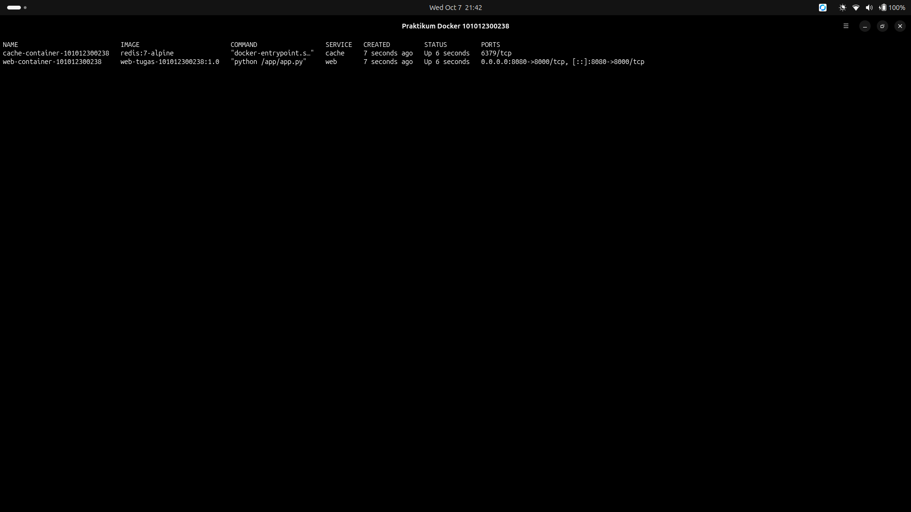
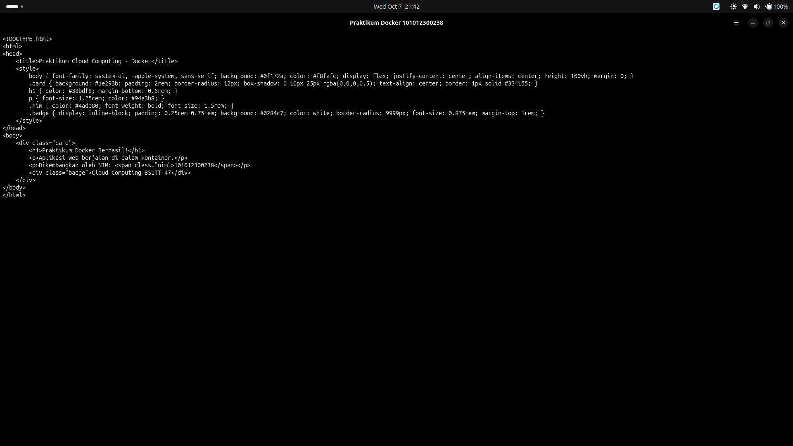

# Laporan Hands-on Docker — Cloud Computing

Nama   : Rafhan Mazaya Fathurrahman
NIM    : 101012300238
Kelas  : BS1TT-47-REG-GAB01
Dosen  : Cahyo Alhazim
Repo   : https://github.com/fhanyuh/cloud-computing-docker-101012300238

## Bagian 1 — Lifecycle Kontainer ubuntu:22.04

### Perintah

```bash
docker run -i --name tes-ubuntu-101012300238 ubuntu:22.04 bash -c 'cat /etc/os-release'
```

```bash
docker ps -a --filter name=tes-ubuntu-101012300238
```

```bash
docker rm tes-ubuntu-101012300238
```

### Output

```
PRETTY_NAME="Ubuntu 22.04.5 LTS"
NAME="Ubuntu"
VERSION_ID="22.04"
VERSION="22.04.5 LTS (Jammy Jellyfish)"
VERSION_CODENAME=jammy
ID=ubuntu
ID_LIKE=debian
HOME_URL="https://www.ubuntu.com/"
SUPPORT_URL="https://help.ubuntu.com/"
BUG_REPORT_URL="https://bugs.launchpad.net/ubuntu/"
PRIVACY_POLICY_URL="https://www.ubuntu.com/legal/terms-and-policies/privacy-policy"
UBUNTU_CODENAME=jammy
```

```
CONTAINER ID   IMAGE          COMMAND                  CREATED        STATUS                              PORTS     NAMES
ff5ff4647379   ubuntu:22.04   "bash -c 'cat /etc/o…"   1 second ago   Exited (0) Less than a second ago             tes-ubuntu-101012300238
```

```
tes-ubuntu-101012300238
Status after rm:
CONTAINER ID   IMAGE     COMMAND   CREATED   STATUS    PORTS     NAMES
```

## Bagian 2 — app.py dan Dockerfile

### app.py

```python
import http.server
import socketserver
import os

PORT = 8000
NIM = os.environ.get("STUDENT_NIM", "UNKNOWN")

class MyHandler(http.server.SimpleHTTPRequestHandler):
    def do_GET(self):
        self.send_response(200)
        self.send_header("Content-type", "text/html; charset=utf-8")
        self.end_headers()
        html = f"""<!DOCTYPE html>
<html>
<head>
    <title>Praktikum Cloud Computing - Docker</title>
    <style>
        body {{ font-family: system-ui, -apple-system, sans-serif; background: #0f172a; color: #f8fafc; display: flex; justify-content: center; align-items: center; height: 100vh; margin: 0; }}
        .card {{ background: #1e293b; padding: 2rem; border-radius: 12px; box-shadow: 0 10px 25px rgba(0,0,0,0.5); text-align: center; border: 1px solid #334155; }}
        h1 {{ color: #38bdf8; margin-bottom: 0.5rem; }}
        p {{ font-size: 1.25rem; color: #94a3b8; }}
        .nim {{ color: #4ade80; font-weight: bold; font-size: 1.5rem; }}
        .badge {{ display: inline-block; padding: 0.25rem 0.75rem; background: #0284c7; color: white; border-radius: 9999px; font-size: 0.875rem; margin-top: 1rem; }}
    </style>
</head>
<body>
    <div class="card">
        <h1>Praktikum Docker Berhasil!</h1>
        <p>Aplikasi web berjalan di dalam kontainer.</p>
        <p>Dikembangkan oleh NIM: <span class="nim">{NIM}</span></p>
        <div class="badge">Cloud Computing BS1TT-47</div>
    </div>
</body>
</html>"""
        self.wfile.write(html.encode("utf-8"))

    def log_message(self, format, *args):
        # Clean logging for container stdout
        print(f"[{self.log_date_time_string()}] {format % args}")

if __name__ == "__main__":
    with socketserver.TCPServer(("", PORT), MyHandler) as httpd:
        print(f"Serving HTTP on port {PORT} with STUDENT_NIM={NIM}")
        httpd.serve_forever()
```

### Dockerfile

```dockerfile
FROM python:3.11-slim
WORKDIR /app
ENV PYTHONUNBUFFERED=1
ENV STUDENT_NIM=101012300238
COPY app.py /app/app.py
EXPOSE 8000
CMD ["python", "/app/app.py"]
```

| Instruksi | Fungsi |
|---|---|
| `FROM python:3.11-slim` | Base image Python minimal untuk menjalankan app.py |
| `WORKDIR /app` | Menetapkan direktori kerja di dalam kontainer |
| `ENV PYTHONUNBUFFERED=1` | Menonaktifkan buffering stdout agar log langsung tampil |
| `ENV STUDENT_NIM=101012300238` | Menyuntikkan NIM sebagai environment variable ke aplikasi |
| `COPY app.py /app/app.py` | Menyalin source code aplikasi ke image |
| `EXPOSE 8000` | Mendeklarasikan port yang digunakan aplikasi di dalam kontainer |
| `CMD ["python", "/app/app.py"]` | Perintah default yang dijalankan saat kontainer start |

### Build

```bash
docker build -t web-tugas-101012300238:1.0 .
```

```
#8 exporting manifest list sha256:e3087ae519052f3f60b23f7af0ad1b9a5105258e4da624498c741d8241708eee 0.0s done
#8 naming to docker.io/library/web-tugas-101012300238:1.0 done
#8 unpacking to docker.io/library/web-tugas-101012300238:1.0 done
#8 DONE 0.1s
```

## Bagian 3 — Docker Compose (service web dan cache)

### docker-compose.yml

```yaml
services:
  web:
    build: .
    image: web-tugas-101012300238:1.0
    container_name: web-container-101012300238
    ports:
      - "8080:8000"
    environment:
      STUDENT_NIM: "101012300238"
    depends_on:
      - cache
    restart: unless-stopped
  cache:
    image: redis:7-alpine
    container_name: cache-container-101012300238
    restart: unless-stopped
```

### Menjalankan

```bash
docker compose up -d
```

### Screenshot 1 — docker compose ps

```bash
docker compose ps
```

| Service | Status | Ports |
|---|---|---|
| web | Up | 0.0.0.0:8080->8000/tcp |
| cache | Up | 6379/tcp |



### Screenshot 2 — curl http://localhost:8080

```bash
curl http://localhost:8080
```

```html
<!DOCTYPE html>
<html>
<head>
    <title>Praktikum Cloud Computing - Docker</title>
    ...
</head>
<body>
    <div class="card">
        <h1>Praktikum Docker Berhasil!</h1>
        <p>Aplikasi web berjalan di dalam kontainer.</p>
        <p>Dikembangkan oleh NIM: <span class="nim">101012300238</span></p>
        <div class="badge">Cloud Computing BS1TT-47</div>
    </div>
</body>
</html>
```



### Menghentikan

```bash
docker compose down
```
